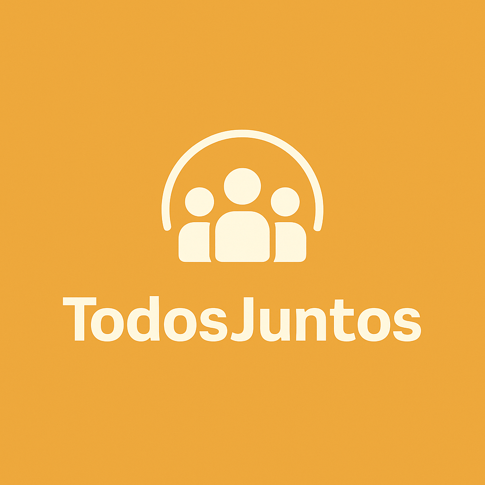

# TodosJuntos

## Introdução

Este projeto foi desenvolvido como parte da disciplina de Interação Humano-Computador (IHC) da Universidade de Brasília (UnB), ministrada pela Profª. Drª. Rejane Maria da Costa Figueiredo. O trabalho tem como foco principal a criação de um guia completo e atualizado sobre acessibilidade digital, incorporando as mais recentes diretrizes nacionais e internacionais.

## TodosJuntos

O TodosJuntos é um guia prático de acessibilidade digital que oferece recursos essenciais para profissionais que desejam criar projetos mais inclusivos. Através de checklists detalhados, análise de ferramentas e diretrizes claras, facilitamos a implementação de boas práticas de acessibilidade em desenvolvimento web, design, criação de conteúdo e gestão de projetos.

## Contribuidores

<table align="center">
  <tr>
    <td align="center"><a href="https://github.com/BrzGab"> <b>Gabriel Lopes</b></a> 
    <td align="center"><a href="https://github.com/taybalau"> <b>Taynara Gabrielle</b></a>    
    <td align="center"><a href="https://github.com/uires2023"> <b>Uires Carlos</b></a>    
    <td align="center"><a href="https://github.com/pedroluizfo"> <b>Pedro Luiz</b></a> 
  </tr>
</table>