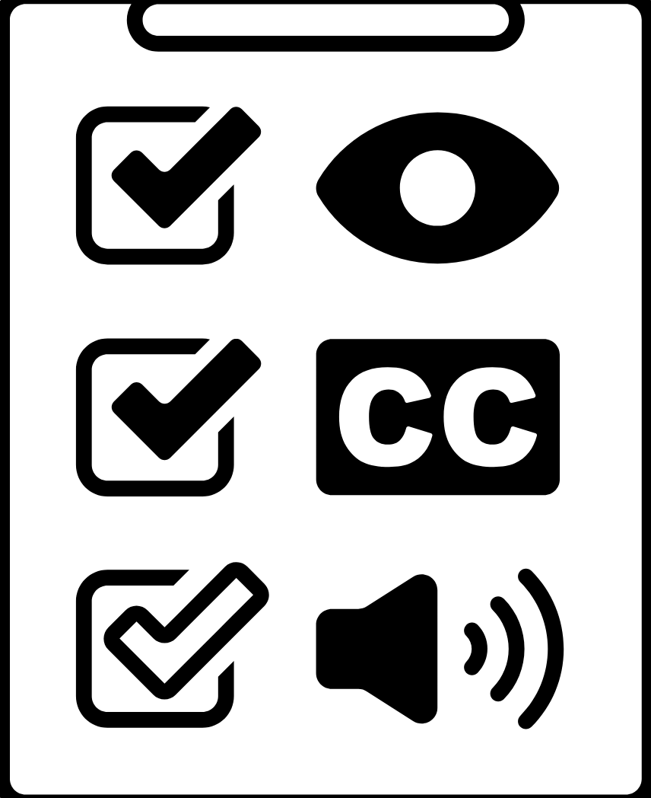

# WebAAA

  

## Introdução

Este projeto foi desenvolvido como parte da disciplina de Interação Humano-Computador (IHC) da Universidade de Brasília (UnB), ministrada pela Profª. Drª. Rejane Maria da Costa Figueiredo. O trabalho representa uma evolução do [VerificaAAA](https://github.com/vitorfleonardo/VerificaAAA), expandindo o conceito original para uma aplicação web interativa focada na verificação de acessibilidade digital. Esta versão incorpora as atualizações do WCAG 2.2, diretrizes da norma ABNT NBR 17225 e orientações do Guia de Boas Práticas para Acessibilidade Digital do Programa de Cooperação entre Reino Unido e Brasil em Acesso Digital.

## WebAAA

O WebAAA é uma aplicação web interativa de verificação de acessibilidade digital que oferece ferramentas práticas para profissionais que desejam criar projetos mais inclusivos. Através de análises automatizadas, relatórios detalhados e verificações em tempo real, a plataforma implementa as diretrizes do WCAG 2.2, norma ABNT NBR 17225 e orientações do Guia de Boas Práticas para Acessibilidade Digital do Programa de Cooperação entre Reino Unido e Brasil em Acesso Digital, facilitando a aplicação de boas práticas de acessibilidade em desenvolvimento web, design, criação de conteúdo e gestão de projetos.

## Contribuidores

<table align="center">
  <tr>
    <td align="center"><a href="https://github.com/BrzGab"> <b>Gabriel Lopes</b></a> 
    <td align="center"><a href="https://github.com/taybalau"> <b>Taynara Gabrielle</b></a>    
    <td align="center"><a href="https://github.com/uires2023"> <b>Uires Carlos</b></a>    
    <td align="center"><a href="https://github.com/pedroluizfo"> <b>Pedro Luiz</b></a> 
  </tr>
</table>

## Histórico de Versões

| Versão | Descrição                                                      | Autor(es)                            | Data       | Revisor(es)         | Data de revisão |
|--------|----------------------------------------------------------------|--------------------------------------|------------|---------------------|------------------|
| 1.0    | Versão inicial do README                                       | [Gabriel Lopes](https://github.com/BrzGab) | 17/06/2025 | [Uires Carlos](https://github.com/uires2023)     | 17/06/2025       |