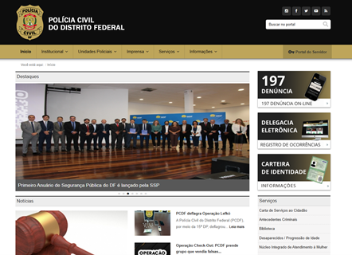
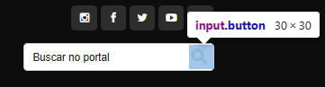

# Avaliação de Acessibilidade - Design

## Aparência

* [x] **Adicionar instrução** que não **dependa exclusivamente da cor**. <a id="TEC1" href="#RP1">[1]</a>

**Justificativa:** O site da PCDF utiliza texto e ícones combinados para identificar ações e navegação, não dependendo exclusivamente de cores para transmitir informações importantes. Isso garante que usuários com deficiência visual cromática possam compreender as funcionalidades.

*Figura 1: O site da PCDF utiliza texto e ícones combinados para identificar ações e navegação, não dependendo exclusivamente de cores para transmitir informações importantes.*

* [x] **Adicionar informação** (como gráficos e diagramas) que não **dependa exclusivamente da cor**. <a id="TEC1" href="#RP1">[1]</a>

**Justificativa:** Gráficos e elementos informativos do site utilizam texto, formas e padrões além da cor para transmitir informações, atendendo aos critérios de acessibilidade visual.

*Figura 2: Gráficos e elementos informativos do site utilizam texto, formas e padrões além da cor para transmitir informações.*

* [x] **Tamanho do texto ajustável** para permitir ampliação. <a id="TEC2" href="#RP2">[2]</a>

**Justificativa:** O site permite ampliação de texto até 200% mantendo funcionalidade e legibilidade, conforme demonstrado no teste de zoom, atendendo às necessidades de usuários com baixa visão.

*Figura 3: O site permite ampliação de texto até 200% mantendo funcionalidade e legibilidade, conforme demonstrado no teste de zoom.*

* [x] **Descrever os controles** pelo nome, não apenas pela aparência ou localização. <a id="TEC3" href="#RP3">[3]</a>

**Justificativa:** Os controles do site são descritos por sua função e nome, não apenas por localização ou aparência visual, facilitando a compreensão por usuários de leitores de tela.

*Figura 4: Os controles do site são descritos por sua função e nome, não apenas por localização ou aparência visual.*

* [ ] **Garantir que dicas visuais** significativas atinjam 3:1 em relação ao fundo. <a id="TEC4" href="#RP4">[4]</a>

**Justificativa:** Ao usar "Tab" para focar campos ou botões (como o ícone de lupa), a borda de foco é muito sutil, quase imperceptível. Provavelmente não atinge o contraste 3:1 com o fundo branco, criando barreiras para usuários com deficiência visual.

*Figura 5: A borda de foco do botão de busca apresenta contraste insuficiente, dificultando a identificação por usuários com deficiência visual.*

* [ ] **Fazer com que as linhas** de texto se ajustem ao viewport. <a id="TEC5" href="#RP5">[5]</a>

**Justificativa:** Algumas seções do site apresentam elementos com largura fixa que não se adaptam adequadamente ao viewport, causando problemas de responsividade. É necessário corrigir elementos que causam largura fixa excessiva, como imagens, iframes ou containers com width: 100vw sem max-width.

*Figura 6: Algumas seções do site apresentam elementos com largura fixa que não se adaptam adequadamente ao viewport, causando problemas de responsividade.*

* [ ] **Oferece uma opção de alto contraste** (dark-mode) de suas páginas web e aumento de fontes. <a id="TEC17" href="#RP17">[17]</a>

**Justificativa:** O site não disponibiliza opções nativas de alto contraste ou dark-mode, e não possui controles próprios de aumento de fonte, o que representa não conformidade com esse critério e limita a acessibilidade para usuários com necessidades visuais específicas.

*Figura 7: O site não disponibiliza opções nativas de alto contraste ou dark-mode, limitando a acessibilidade para usuários com necessidades visuais específicas.*

* [x] **Parágrafos com no máximo 80 caracteres por linha**. <a id="TEC10" href="#RP10">[10]</a>

**Justificativa:** A maioria dos parágrafos respeita o limite de 80 caracteres por linha, facilitando a leitura e compreensão do conteúdo. Em telas grandes, os textos (especialmente notícias e blocos informativos) podem ter linhas maiores que 80 caracteres, devido ao uso de larguras amplas em containers.

*Figura 8: A maioria dos parágrafos respeita o limite de 80 caracteres por linha, facilitando a leitura e compreensão do conteúdo.*

* [x] **Evita** o uso de **textos longos em caixa alta ou condensados**. <a id="TEC10" href="#RP10">[10]</a>

**Justificativa:** O site utiliza caixa alta apenas em textos curtos como botões e menus, mantendo textos longos em formato normal para melhor legibilidade. No site da PCDF, alguns títulos e botões usam caixa alta, mas em textos curtos (botões, menus). Textos longos (notícias, descrições) estão corretamente em caixa baixa / formato normal, o que é positivo. Uso de fontes condensadas não é identificado nas principais áreas do site.

*Figura 9: O site utiliza caixa alta apenas em textos curtos como botões e menus, mantendo textos longos em formato normal para melhor legibilidade.*

* [x] **Evita o alinhamento justificado**. <a id="TEC10" href="#RP10">[10]</a>

**Justificativa:** Os textos do site utilizam alinhamento à esquerda, evitando o alinhamento justificado que pode causar espaçamento irregular e dificultar a leitura.

*Figura 10: Os textos do site utilizam alinhamento à esquerda, evitando o alinhamento justificado que pode causar espaçamento irregular.*

* [x] **Fontes são fluidas** e de fácil entendimento. <a id="TEC10" href="#RP10">[10]</a>

**Justificativa:** O site emprega fontes sans-serif claras e legíveis, facilitando a leitura e compreensão do conteúdo. Utiliza fontes sans-serif simples e modernas, o que favorece a leitura.

*Figura 11: O site emprega fontes sans-serif claras e legíveis, facilitando a leitura e compreensão do conteúdo.*

* [x] **Toma o devido cuidado com `display:none` e `visibility:hidden` para os recursos de tecnologia assistiva**. <a id="TEC18" href="#RP18">[18]</a>

**Justificativa:** O site utiliza adequadamente propriedades CSS para ocultar elementos mantendo compatibilidade com tecnologias assistivas. Existem alguns elementos como menus colapsáveis, banners e conteúdos alternativos que utilizam display: none para ocultação apropriada.

*Figura 12: O site utiliza adequadamente propriedades CSS para ocultar elementos mantendo compatibilidade com tecnologias assistivas.*

* [x] **Preferir botões com texto e ícone**. E botões apenas com ícones têm o nome acessível. <a id="TEC19" href="#RP19">[19]</a>

**Justificativa:** Os botões do site combinam texto e ícones, proporcionando clareza na identificação de suas funções e melhorando a acessibilidade.

*Figura 13: Os botões do site combinam texto e ícones, proporcionando clareza na identificação de suas funções.*

* [x] **Links devem ter aparência distinta** (como texto sublinhado e cor diferente). <a id="TEC11" href="#RP11">[11]</a>

**Justificativa:** Os links são visualmente distinguíveis através de cor diferenciada, facilitando sua identificação no conteúdo.

*Figura 14: Os links são visualmente distinguíveis através de cor diferenciada, facilitando sua identificação no conteúdo.*

* [ ] **Área de clique dos botões com no mínimo 44x44 px**. <a id="TEC13" href="#RP13">[13]</a>

**Justificativa:** O botão de busca (lupa) possui área de clique menor que o recomendado (44x44px), dificultando sua utilização em dispositivos móveis. Botão da lupa (buscar): Visualmente pequeno. Área de clique: aproximadamente 32x32 pixels.

*Figura 15: O botão de busca (lupa) possui área de clique menor que o recomendado (44x44px), dificultando sua utilização em dispositivos móveis.*

## Animação

* [x] **Evitar conteúdo que pisque**, ou mantê-lo abaixo dos limites. <a id="TEC6" href="#RP6">[6]</a>

**Justificativa:** O site não apresenta elementos que piscam automaticamente, evitando problemas para usuários com epilepsia fotossensível.

*Figura 16: O site não apresenta elementos que piscam automaticamente, evitando problemas para usuários com epilepsia fotossensível.*

* [ ] **Permitir que os usuários controlem as alterações de conteúdo** que ocorrem em paralelo com outro conteúdo. <a id="TEC7" href="#RP7">[7]</a>

**Justificativa:** Os banners do site mudam automaticamente sem oferecer controles para pausar ou navegar manualmente, prejudicando a acessibilidade. Os banners mudam automaticamente após alguns segundos.

*Figura 17: Os banners do site mudam automaticamente sem oferecer controles para pausar ou navegar manualmente, prejudicando a acessibilidade.*

* [ ] **Toda a animação** deve obedecer à `prefers-reduced-motion` consulta de mídia. <a id="TEC8" href="#RP8">[8]</a>

**Justificativa:** O site não implementa a consulta de mídia prefers-reduced-motion, não respeitando preferências de usuários sensíveis a movimento. O site não respeita a configuração de usuários que solicitam redução de movimento.

*Figura 18: O site não implementa a consulta de mídia prefers-reduced-motion, não respeitando preferências de usuários sensíveis a movimento.*

## Contraste de Cores

* [x] **Verificar o contraste** de todo texto tamanho normal. <a id="TEC9" href="#RP9">[9]</a>

**Justificativa:** O site apresenta contraste adequado para textos de tamanho normal, atendendo aos critérios de acessibilidade. Tem bom contraste na maior parte do conteúdo textual, especialmente nos blocos principais e cabeçalhos.

*Figura 19: O site apresenta contraste adequado para textos de tamanho normal, atendendo aos critérios de acessibilidade.*

* [x] **Verificar o contraste** de todo texto tamanho grande. <a id="TEC9" href="#RP9">[9]</a>

**Justificativa:** Textos grandes mantêm contraste adequado, facilitando a leitura para usuários com deficiência visual. Atende bem o critério de contraste para texto grande, com cores de texto e fundos que proporcionam contraste acima do mínimo recomendado (3:1).

*Figura 20: Textos grandes mantêm contraste adequado, facilitando a leitura para usuários com deficiência visual.*

* [x] **Verificar `::selection` cores** personalizadas. <a id="TEC9" href="#RP9">[9]</a>

**Justificativa:** O site utiliza as cores padrão do navegador para seleção de texto, garantindo contraste adequado. Não utiliza cores personalizadas para seleção, usando padrão seguro do navegador.

*Figura 21: O site utiliza as cores padrão do navegador para seleção de texto, garantindo contraste adequado.*

## Checklists de Design - ABNT NBR 17225:2025

### Contraste de Cores
- [ ] **Verificar o texto** que se sobrepõe a imagens ou vídeos.

**Justificativa:** Alguns textos sobrepostos a imagens apresentam contraste insuficiente, dificultando a leitura. Testado com Ctrl + A (Selecionar tudo): Isso destaca textos ocultos ou com baixo contraste em relação ao fundo.

*Figura 22: Alguns textos sobrepostos a imagens apresentam contraste insuficiente, dificultando a leitura.*

## Checklists de Design - Guia de Boas Práticas para Acessibilidade Digital

### Design

- [x] **Design Responsivo**: Certificar-se de que o design é responsivo e se adapta a diferentes dispositivos, incluindo móveis e desktops.

**Justificativa:** O site apresenta design responsivo adequado, adaptando-se corretamente a diferentes tamanhos de tela e dispositivos móveis. Layout adapta-se corretamente em celular, Menu móvel aparece corretamente.

*Figura 23: O site apresenta design responsivo adequado, adaptando-se corretamente a diferentes tamanhos de tela e dispositivos móveis.*

---

## Referências Bibliográficas

> <a id="RP1" href="#TEC1">1.</a> WCAG 2.2 Understanding Docs. SC 1.4.1 Use of Color (Level A).

> <a id="RP2" href="#TEC2">2.</a> WCAG 2.2 Understanding Docs. SC 1.4.4 Resize Text (Level AA).

> <a id="RP3" href="#TEC3">3.</a> WCAG 2.2 Understanding Docs. SC 1.3.3 Sensory Characteristics (Level A).

> <a id="RP4" href="#TEC4">4.</a> WCAG 2.2 Understanding Docs. SC 1.4.11 Non-text Contrast (Level AA).

> <a id="RP5" href="#TEC5">5.</a> WCAG 2.2 Understanding Docs. SC 1.4.10 Reflow (Level AA).

> <a id="RP6" href="#TEC6">6.</a> WCAG 2.2 Understanding Docs. SC 2.3.1 Three Flashes or Below Threshold (Level A).

> <a id="RP7" href="#TEC7">7.</a> WCAG 2.2 Understanding Docs. SC 2.2.2 Pause, Stop, Hide (Level A).

> <a id="RP8" href="#TEC8">8.</a> WCAG 2.2 Understanding Docs. SC 2.3.3 Animation from Interactions (Level AAA).

> <a id="RP9" href="#TEC9">9.</a> WCAG 2.2 Understanding Docs. SC 1.4.3 Contrast (Minimum) (Level AA).

> <a id="RP10" href="#TEC10">10.</a> Guia de Boas Práticas para Acessibilidade Digital (UK-BR), p. 43–44. Disponível em: [https://www.gov.br/governodigital/pt-br/acessibilidade-e-usuario/acessibilidade-digital](https://www.gov.br/governodigital/pt-br/acessibilidade-e-usuario/acessibilidade-digital)

> <a id="RP11" href="#TEC11">11.</a> Guia de Boas Práticas para Acessibilidade Digital (UK-BR), p. 45. Links com aparência distinta e foco de teclado evidente.

> <a id="RP12" href="#TEC12">12.</a> ABNT NBR 17225:2025, item 5.8.3 – Texto, alt ou nome acessível para botões.

> <a id="RP13" href="#TEC13">13.</a> ABNT NBR 17225:2025, item 5.8.6 – Área de acionamento mínima de 44px. Reforçado por: UK-BR p. 36–37.

> <a id="RP14" href="#TEC14">14.</a> Guia UK-BR, p. 29. Redimensionamento de texto com zoom em até 200%.

> <a id="RP15" href="#TEC15">15.</a> Guia UK-BR, p. 50. Não usar texto dentro de imagens.

> <a id="RP16" href="#TEC16">16.</a> Guia UK-BR, p. 45. Evitar parallax e dar controle de animação ao usuário.

> <a id="RP17" href="#TEC17">17.</a> WCAG 2.2 Understanding Docs. SC 1.4.8 Visual Presentation (Level AAA). Opções de apresentação visual incluindo alto contraste.

> <a id="RP18" href="#TEC18">18.</a> WCAG 2.2 Understanding Docs. SC 4.1.2 Name, Role, Value (Level A). Uso adequado de display:none e visibility:hidden.

> <a id="RP19" href="#TEC19">19.</a> ABNT NBR 17225:2025, item 5.8.3 – Nome acessível para botões e controles interativos.

## Bibliografia

> DINIZ, V.; FERRAZ, R.; NASCIMENTO, C. M.; CREDIDIO, R. *Guia de Boas Práticas para Acessibilidade Digital*. Programa de Cooperação entre Reino Unido e Brasil em Acesso Digital, 2023.
> Disponível em: [https://www.gov.br/governodigital/pt-br/acessibilidade-e-usuario/acessibilidade-digital/guiaboaspraaticasparaacessibilidadedigital.pdf](https://www.gov.br/governodigital/pt-br/acessibilidade-e-usuario/acessibilidade-digital/guiaboaspraaticasparaacessibilidadedigital.pdf)

> ABNT. *NBR 17225:2025 – Acessibilidade em interfaces digitais baseadas em web*. Rio de Janeiro, 2025.

## Histórico de Versões

| Versão | Descrição | Autor(es) | Data | Revisor(es) | Data de revisão |
|--------|-----------|-----------|------|-------------|-----------------|
| 1.0 | Adição de WCAG 2.2 e conformidade ABNT NBR 17225:2025 | [Uires Carlos](https://github.com/uires2023) | 25/06/2025 | [Gabriel Lopes](https://github.com/BrzGab) | 25/06/2025 |