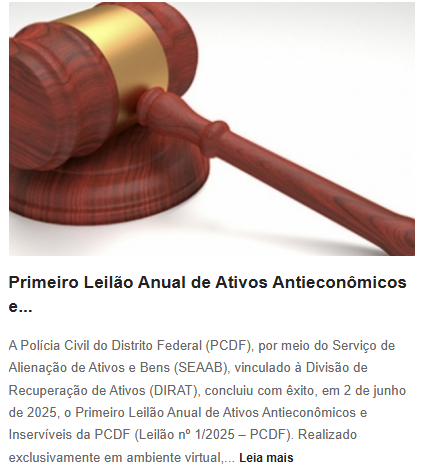
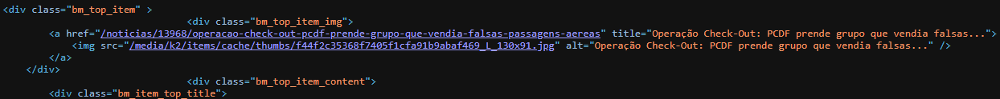
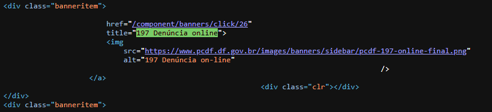
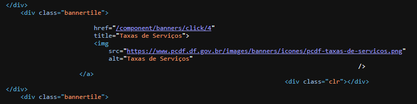
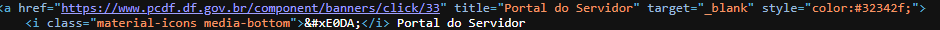
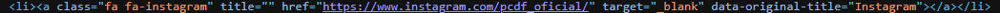
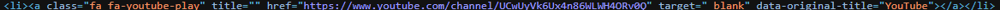
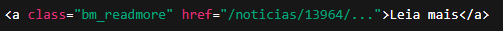
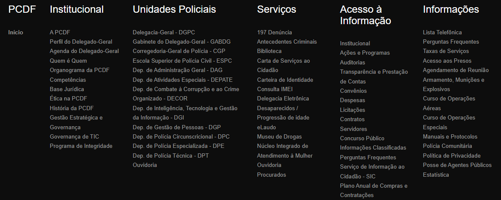
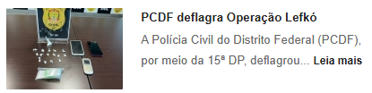

# Avaliação quanto a Geração de Conteúdo

## Textos
- [x] Usar textos descomplicados e objetivos. <a id="TEC1" href="#RP1">[1]</a>
- [x] Uso de palavras conhecidas. <a id="TEC2" href="#RP2">[2]</a>
- [ ] Evitar figuras de linguagem e frases com "senso de urgência". <a id="TEC3" href="#RP3">[3]</a>
- [x] Usar pontuação adequada. <a id="TEC4" href="#RP4">[4]</a>
- [ ] Evitar frases extensas (ideal é ter de 15 a 20 palavras). <a id="TEC5" href="#RP5">[5]</a>
- [x] Usar preferencialmente a ordem direta nas orações. <a id="TEC6" href="#RP6">[6]</a> 

*Figura 1: Demonstração de uma das notícias na homepage da PCDF, evidenciando a aplicação dos critérios de clareza e objetividade textual.*

## Descrição de imagens
- [ ] Identificar o tipo de imagem e personagem (foto, ilustração, mapa, gráfico... e "o que / quem"). <a id="TEC7" href="#RP7">[7]</a>
- [ ] Localizar (onde). <a id="TEC8" href="#RP8">[8]</a>
- [ ] Descrever a ação (o que faz, como faz). <a id="TEC9" href="#RP9">[9]</a>
- [ ] Referenciar. <a id="TEC10" href="#RP10">[10]</a> 

*Figura 2: Código HTML da homepage da PCDF mostrando a ausência dos critérios recomendados para descrição adequada de imagens.*

## Descrição de imagens complexas
- [ ] Descrição sucinta no texto alternativo. <a id="TEC11" href="#RP7">[7]</a>

*Figura 3: Análise do código HTML da homepage revelando que a frase "197 Denúncia on-line", apesar de sucinta, não descreve adequadamente o tipo de imagem, ação e contexto visual.*

## Ícones
- [x] Adicionar iconografia. <a id="TEC12" href="#RP8">[8]</a> 

*Figura 4: Código HTML da homepage demonstrando o uso correto de imagens como ícones funcionais associados a links.*

- [x] Adicionar ícone e texto. <a id="TEC13" href="#RP8">[8]</a> 

*Figura 5: Implementação adequada de ícones com texto adjacente (exemplo: "Portal do Servidor") na homepage da PCDF.*

- [ ] Adicionar texto alternativo para ícones clicáveis. <a id="TEC14" href="#RP7">[7]</a> 

*Figura 6: Identificação de ícones sem atributos alt, aria-label adequados e com title vazio no código HTML da homepage.*

- [ ] Descrever no texto alternativo, quando necessário usá-lo, a ação da pessoa usuária e para onde será direcionada. <a id="TEC15" href="#RP9">[9]</a> 

*Figura 7: Análise dos links com ícones sociais na homepage que não informam sobre abertura em nova aba ou redirecionamento para site externo, conforme exigido pela WCAG.*

## Hashtags e Emojis
- [x] Não abusar de emojis, pois nem sempre sua descrição é suficiente para um bom entendimento. <a id="TEC16" href="#RP2">[2]</a> 

## Hiperlinks
- [ ] Descrição de links e botões devem ser compreensíveis de maneira isolada. <a id="TEC17" href="#RP1">[1]</a> 

*Figura 8: Código HTML da homepage mostrando o hiperlink "Leia mais" que, isoladamente, não indica o destino ou contexto do conteúdo, comprometendo a acessibilidade.*

## WCAG 2.2 - Atualizações para Conteúdo

### Ajuda Consistente
- [x] **Localização consistente** de links de ajuda, chat, FAQ em todas as páginas. <a id="TEC18" href="#RP4">[4]</a>
- [x] **Mesma ordem** quando múltiplas opções de ajuda são oferecidas. <a id="TEC19" href="#RP4">[4]</a>
- [ ] **Texto idêntico** para os mesmos mecanismos de ajuda. <a id="TEC20" href="#RP4">[4]</a>

*Figura 9: Rodapé do site da PCDF demonstrando a implementação adequada da maioria dos critérios de ajuda consistente.*

## Norma ABNT - Conteúdo Acessível

### Linguagem e Comunicação
- [x] **Português brasileiro claro** - evitar regionalismos excessivos. <a id="TEC21" href="#RP2">[2]</a>
- [x] **Listas e tópicos** para facilitar leitura. <a id="TEC22" href="#RP1">[1]</a>
- [x] **Definir siglas** na primeira ocorrência. <a id="TEC23" href="#RP10">[10]</a>

*Figura 10: Análise do rodapé do site demonstrando a aplicação adequada dos critérios de linguagem e comunicação acessível.*

## Norma ABNT NBR 17225:2025 - Checklist C

### Conteúdo Textual (Seção 5.12 da ABNT)
- [ ] **Espaçamento entre linhas** - Mínimo 1,5x o tamanho da fonte <a id="TEC52" href="#RP3">[3]</a>
- [x] **Alinhamento de blocos de texto** - À esquerda para português, evitar justificado <a id="TEC24" href="#RP4">[4]</a>
- [x] **Largura de blocos de texto** - Máximo 80 caracteres por linha <a id="TEC25" href="#RP4">[4]</a>
- [x] **Texto redimensionado** - Funcional até 200% de zoom sem scroll horizontal <a id="TEC26" href="#RP4">[4]</a>
- [ ] **Semântica de texto especial** - Ênfase, citações, abreviações marcadas programaticamente <a id="TEC27" href="#RP4">[4]</a>
- [ ] **Uso correto de texto especial** - Elementos semânticos para seus propósitos reais <a id="TEC28" href="#RP4">[4]</a>
- [ ] **Definições de significado** - Mecanismo para termos técnicos e jargões - Recomendação AAA <a id="TEC29" href="#RP1">[1]</a>
- [ ] **Siglas e abreviaturas** - Forma expandida disponível - Recomendação AAA <a id="TEC30" href="#RP10">[10]</a>

### Cabeçalhos (Seção 5.3 da ABNT)
- [x] **Semântica de cabeçalho** - Todos os títulos usam elementos h1-h6 apropriados <a id="TEC53" href="#RP4">[4]</a>
- [x] **Uso correto de cabeçalhos** - Para identificar seções de conteúdo, não estilização <a id="TEC31" href="#RP4">[4]</a>
- [ ] **Cabeçalho principal** - Um único h1 por página identificando o conteúdo - Recomendação AAA <a id="TEC32" href="#RP4">[4]</a>
- [ ] **Estrutura hierárquica** - Sequência lógica sem pular níveis (h1→h2→h3) <a id="TEC33" href="#RP4">[4]</a>

### Links e Navegação (Seção 5.7 da ABNT)
- [x] **Semântica de link** - Todos os links usam elemento `<a>` com href <a id="TEC54" href="#RP5">[5]</a>
- [x] **Uso correto de links** - Para navegação, não para acionar funcionalidades <a id="TEC34" href="#RP5">[5]</a>
- [x] **Links em nova guia/janela** - Informar sobre mudança de contexto - Recomendação AAA <a id="TEC35" href="#RP5">[5]</a>

## Guia UK-Brasil - Conteúdo Inclusivo

### Considerações Culturais
- [x] **Exemplos contextualizados** para realidade brasileira. <a id="TEC36" href="#RP2">[2]</a>
- [x] **Evitar referências culturais** excludentes. <a id="TEC37" href="#RP2">[2]</a>
- [x] **Linguagem neutra** quando apropriado. <a id="TEC38" href="#RP2">[2]</a>
- [x] **Respeitar diferentes níveis** de escolaridade. <a id="TEC39" href="#RP1">[1]</a>

## Técnicas Avançadas de Conteúdo Acessível

### Estruturação de Informação
- [ ] **Pirâmide invertida** - Informação mais importante primeiro <a id="TEC40" href="#RP1">[1]</a>
- [ ] **Escaneabilidade** - Subtítulos, listas, destaques <a id="TEC41" href="#RP1">[1]</a>
- [ ] **Quebra visual** - Evitar "paredes de texto" <a id="TEC42" href="#RP1">[1]</a>
- [ ] **Resumos executivos** - Para conteúdos longos <a id="TEC43" href="#RP1">[1]</a>
- [ ] **Índices navegáveis** - Links para seções específicas <a id="TEC44" href="#RP5">[5]</a>

### Adaptação Cultural para Brasil
- [x] **Referências nacionais** - Usar exemplos brasileiros quando possível <a id="TEC45" href="#RP2">[2]</a>
- [x] **Moeda e medidas** - Real brasileiro, sistema métrico <a id="TEC46" href="#RP2">[2]</a>
- [x] **Datas e horários** - Formato brasileiro (DD/MM/AAAA) <a id="TEC47" href="#RP2">[2]</a>
- [ ] **Legislação aplicável** - LBI, Decreto 5.296, ABNT NBR 17225 <a id="TEC48" href="#RP10">[10]</a>
- [x] **Órgãos e instituições** - Referências a entidades brasileiras <a id="TEC49" href="#RP2">[2]</a>

### Feedback do Usuário
- [ ] **Canal dedicado**: Para questões de acessibilidade <a id="TEC50" href="#RP4">[4]</a>
- [ ] **Métricas de satisfação**: NPS segmentado por tipo de usuário <a id="TEC51" href="#RP4">[4]</a>

---

## Referências Bibliográficas

> <a id="RP1" href="#TEC1">1.</a> WCAG 2.2 Understanding Docs. SC 3.1.5 Reading Level (Level AAA). Textos descomplicados.

> <a id="RP2" href="#TEC2">2.</a> Guia de Boas Práticas para Acessibilidade Digital (UK-BR), p. 18. Uso de palavras conhecidas.

> <a id="RP3" href="#TEC3">3.</a> Guia de Boas Práticas para Acessibilidade Digital (UK-BR), p. 19. Evitar figuras de linguagem.

> <a id="RP4" href="#TEC4">4.</a> ABNT NBR 17225:2025, item 5.4.2 – Pontuação adequada.

> <a id="RP5" href="#TEC5">5.</a> Guia de Boas Práticas para Acessibilidade Digital (UK-BR), p. 17. Frases com 15-20 palavras.

> <a id="RP6" href="#TEC6">6.</a> Guia de Boas Práticas para Acessibilidade Digital (UK-BR), p. 17. Ordem direta nas orações.

> <a id="RP7" href="#TEC7">7.</a> Guia de Boas Práticas para Acessibilidade Digital (UK-BR), p. 22. Identificação de elementos visuais.

> <a id="RP8" href="#TEC8">8.</a> Guia de Boas Práticas para Acessibilidade Digital (UK-BR), p. 22. Localização espacial.

> <a id="RP9" href="#TEC9">9.</a> Guia de Boas Práticas para Acessibilidade Digital (UK-BR), p. 22. Descrição de ações.

> <a id="RP10" href="#TEC10">10.</a> ABNT NBR 17225:2025, item 5.3.1 – Referenciamento adequado.

## Histórico de Versões

| Versão | Descrição | Autor(es) | Data | Revisor(es) | Data de revisão |
|--------|-----------|-----------|------|-------------|-----------------|
| 1.0 | Criação da página | [Pedro Luiz](https://github.com/pedroluizfo) | 23/06/2025 | - | - |
| 2.0 | Verificação do site junto ao Checklist | [Taynara Vitorino](https://github.com/taybalau) | 24/06/2025 | - | - |