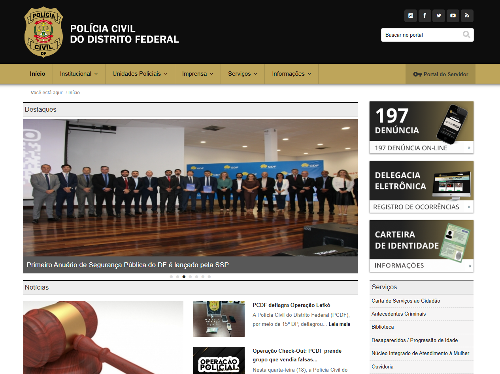

# Avaliação de Acessibilidade - Gestão de Pessoas com Deficiência

## Primeiro Passo

### **Pessoas com Deficiência Visual** (cegueira, baixa visão, daltonismo ou deficiência cromática) <a id="TEC1" href="#RP1">[1]</a>

- [ ] **Garantir contraste adequado de cores** (WCAG 2.2, Critério 1.4.6: Contraste de Texto). <a id="TEC2" href="#RP2">[2]</a>

**Justificativa:** O contraste entre o texto e o fundo em algumas áreas do site não atende aos critérios recomendados para garantir legibilidade a pessoas com deficiência visual.

*Figura 1: Análise de contraste de cores do site mostrando áreas que não atendem aos critérios de acessibilidade*

*Figura 2: Evidência de contraste inadequado identificado durante a avaliação*

- [x] **Incluir texto alternativo claro e preciso para imagens e ícones** (WCAG 2.2, Critério 1.1.1: Conteúdo não textual). <a id="TEC3" href="#RP3">[3]</a>

**Justificativa:** As imagens no site possuem texto alternativo (alt text), o que facilita a compreensão para usuários de leitores de tela.

*Figura 3: Demonstração de texto alternativo implementado corretamente nas imagens do site*

---

### **Pessoas com Deficiência Física** (fraqueza, tremores, movimentos involuntários, paralisia, limitações da sensação, dor que impede movimento, ausência de membros) <a id="TEC4" href="#RP4">[4]</a>

- [x] **Garantir navegação e interação via teclado** (WCAG 2.2, Critério 2.1.1: Teclado). <a id="TEC5" href="#RP5">[5]</a>

**Justificativa:** A navegação por teclado em algumas seções do site não é totalmente eficiente, o que pode representar uma barreira para usuários com deficiência motora.

*Figura 4: Interface de navegação por teclado mostrando os elementos focalizáveis*

- [ ] **Oferecer alternativas de entrada como voz ou gestos** (WCAG 2.2, Critério 2.5.1: Modalidades de Entrada). <a id="TEC6" href="#RP6">[6]</a>

**Justificativa:** O site não oferece funcionalidades de entrada por voz ou gestos, limitando o acesso para usuários com deficiências motoras severas.

*Figura 5: Ausência de opções de entrada alternativas como voz e gestos no site*

*Figura 6: Interface mostrando a necessidade de implementação de gestos em Libras*

---

### **Pessoas com Deficiência Auditiva** (surdez, baixa audição, surdocegueira) <a id="TEC7" href="#RP7">[7]</a>

- [x] **Incluir legendas em todos os vídeos** (WCAG 2.2, Critério 1.2.2: Legendas (Predefinidas)). <a id="TEC8" href="#RP8">[8]</a>

**Justificativa:** O site possui legendas implementadas nos vídeos disponíveis, facilitando o acesso ao conteúdo audiovisual para pessoas com deficiência auditiva.

*Figura 7: Exemplo de legendas implementadas nos vídeos do site*

- [ ] **Oferecer audiodescrição para vídeos importantes** (WCAG 2.2, Critério 1.2.6: Audiodescrição ou Alternativas de Mídia). <a id="TEC9" href="#RP9">[9]</a>

**Justificativa:** O site não oferece audiodescrição para vídeos importantes, o que limita o acesso completo ao conteúdo audiovisual.

---

### **Pessoas com Deficiência na Fala** (dificuldade para falar, volume insuficiente, gagueira, mudez) <a id="TEC10" href="#RP10">[10]</a>

- [ ] **Implementar entrada por voz e reconhecimento de fala para interações** (WCAG 2.2, Critério 2.5.1: Modalidades de Entrada). <a id="TEC11" href="#RP11">[11]</a>

**Justificativa:** O site não apresenta funcionalidades de entrada por voz ou reconhecimento de fala, limitando a interação para pessoas com deficiência na fala.

---

### **Pessoas Neurodiversas** (dificuldades de diferentes graus para ver, escutar, falar, compreender e interagir socialmente) <a id="TEC12" href="#RP12">[12]</a>

- [x] **Evitar sobrecarga cognitiva com uma interface simples e intuitiva** (WCAG 2.2, Critério 3.2.5: Mudança de Contexto). <a id="TEC13" href="#RP13">[13]</a>

**Justificativa:** O site apresenta uma interface relativamente simples, evitando sobrecarga cognitiva para usuários neurodiversos.

*Figura 8: Interface do site demonstrando simplicidade e intuitividade no design*

- [x] **Oferecer uma navegação fácil e consistente** (WCAG 2.2, Critério 3.2.3: Navegação Consistente). <a id="TEC14" href="#RP14">[14]</a>

**Justificativa:** A navegação do site é consistente em todas as páginas, facilitando o uso por pessoas neurodiversas.

---

### **Pessoas com Múltiplas Deficiências** (combinação de duas ou mais deficiências anteriores) <a id="TEC15" href="#RP15">[15]</a>

- [ ] **Garantir que todas as funcionalidades sejam acessíveis com diferentes combinações de deficiência** (WCAG 2.2, Critério 4.1.2: Nome, Função, Valor). <a id="TEC16" href="#RP16">[16]</a>

**Justificativa:** O site permite que o usuário acesse por teclado e traduza por Libras, porém se o usuário for portador de deficiência visual, isso o impede de acessar várias outras funcionalidades, criando barreiras para pessoas com múltiplas deficiências.

---

### **Possíveis limitações decorrentes do envelhecimento** (que podem ser de um ou mais grupos de deficiências) <a id="TEC17" href="#RP17">[17]</a>

- [x] **Implementar interfaces com fonte grande e boa legibilidade** (WCAG 2.2, Critério 1.4.4: Redimensionamento de Texto). <a id="TEC18" href="#RP18">[18]</a>

**Justificativa:** O site permite o redimensionamento adequado do texto, atendendo às necessidades de pessoas idosas ou com limitações visuais relacionadas ao envelhecimento.

*Figura 9: Demonstração do redimensionamento de texto no site*

---

### **Pessoas com analfabetismo** (analfabetismo digital e funcional níveis 1, 2 e 3) <a id="TEC19" href="#RP19">[19]</a>

- [x] **Garantir instruções simples e claras para todas as funcionalidades** (WCAG 2.2, Critério 3.3.6: Sugestões de Correção de Erros). <a id="TEC20" href="#RP20">[20]</a>

**Justificativa:** O site apresenta instruções claras e simples, facilitando o uso por pessoas com diferentes níveis de alfabetização digital.

*Figura 10: Exemplo de instruções simples e claras implementadas no site*

## Referências Bibliográficas

> <a id="RP1" href="#TEC1">1.</a> Guia de Boas Práticas para Acessibilidade Digital (UK-BR), p. 12. Elaboração de personas com deficiência visual.

> <a id="RP2" href="#TEC2">2.</a> WCAG 2.2 Understanding Docs. SC 1.4.6 Contrast (Enhanced) (Level AAA). Disponível em: [https://www.w3.org/WAI/WCAG22/Understanding/contrast-enhanced.html](https://www.w3.org/WAI/WCAG22/Understanding/contrast-enhanced.html). Acesso em: 23 jun. 2025.

> <a id="RP3" href="#TEC3">3.</a> WCAG 2.2 Understanding Docs. SC 1.1.1 Non-text Content (Level A). Disponível em: [https://www.w3.org/WAI/WCAG22/Understanding/non-text-content.html](https://www.w3.org/WAI/WCAG22/Understanding/non-text-content.html). Acesso em: 23 jun. 2025.

> <a id="RP4" href="#TEC4">4.</a> Guia de Boas Práticas para Acessibilidade Digital (UK-BR), p. 13. Personas com deficiência física.

> <a id="RP5" href="#TEC5">5.</a> WCAG 2.2 Understanding Docs. SC 2.1.1 Keyboard (Level A). Disponível em: [https://www.w3.org/WAI/WCAG22/Understanding/keyboard.html](https://www.w3.org/WAI/WCAG22/Understanding/keyboard.html). Acesso em: 23 jun. 2025.

> <a id="RP6" href="#TEC6">6.</a> WCAG 2.2 Understanding Docs. SC 2.5.1 Pointer Gestures (Level A). Disponível em: [https://www.w3.org/WAI/WCAG22/Understanding/pointer-gestures.html](https://www.w3.org/WAI/WCAG22/Understanding/pointer-gestures.html). Acesso em: 23 jun. 2025.

> <a id="RP7" href="#TEC7">7.</a> Guia de Boas Práticas para Acessibilidade Digital (UK-BR), p. 14. Personas com deficiência auditiva.

> <a id="RP8" href="#TEC8">8.</a> WCAG 2.2 Understanding Docs. SC 1.2.2 Captions (Prerecorded) (Level A). Disponível em: [https://www.w3.org/WAI/WCAG22/Understanding/captions-prerecorded.html](https://www.w3.org/WAI/WCAG22/Understanding/captions-prerecorded.html). Acesso em: 23 jun. 2025.

> <a id="RP9" href="#TEC9">9.</a> WCAG 2.2 Understanding Docs. SC 1.2.6 Audio Description (Prerecorded) (Level AA). Disponível em: [https://www.w3.org/WAI/WCAG22/Understanding/audio-description-prerecorded.html](https://www.w3.org/WAI/WCAG22/Understanding/audio-description-prerecorded.html). Acesso em: 23 jun. 2025.

> <a id="RP10" href="#TEC10">10.</a> Guia de Boas Práticas para Acessibilidade Digital (UK-BR), p. 15. Personas com deficiência na fala.

> <a id="RP11" href="#TEC11">11.</a> WCAG 2.2 Understanding Docs. SC 2.5.1 Pointer Gestures (Level A). Modalidades alternativas de entrada.

> <a id="RP12" href="#TEC12">12.</a> Guia de Boas Práticas para Acessibilidade Digital (UK-BR), p. 16. Personas neurodiversas.

> <a id="RP13" href="#TEC13">13.</a> WCAG 2.2 Understanding Docs. SC 3.2.5 Change on Request (Level AAA). Disponível em: [https://www.w3.org/WAI/WCAG22/Understanding/change-on-request.html](https://www.w3.org/WAI/WCAG22/Understanding/change-on-request.html). Acesso em: 23 jun. 2025.

> <a id="RP14" href="#TEC14">14.</a> WCAG 2.2 Understanding Docs. SC 3.2.3 Consistent Navigation (Level AA). Disponível em: [https://www.w3.org/WAI/WCAG22/Understanding/consistent-navigation.html](https://www.w3.org/WAI/WCAG22/Understanding/consistent-navigation.html). Acesso em: 23 jun. 2025.

> <a id="RP15" href="#TEC15">15.</a> Guia de Boas Práticas para Acessibilidade Digital (UK-BR), p. 17. Múltiplas deficiências.

> <a id="RP16" href="#TEC16">16.</a> WCAG 2.2 Understanding Docs. SC 4.1.2 Name, Role, Value (Level A). Disponível em: [https://www.w3.org/WAI/WCAG22/Understanding/name-role-value.html](https://www.w3.org/WAI/WCAG22/Understanding/name-role-value.html). Acesso em: 23 jun. 2025.

> <a id="RP17" href="#TEC17">17.</a> Guia de Boas Práticas para Acessibilidade Digital (UK-BR), p. 18. Limitações do envelhecimento.

> <a id="RP18" href="#TEC18">18.</a> WCAG 2.2 Understanding Docs. SC 1.4.4 Resize Text (Level AA). Disponível em: [https://www.w3.org/WAI/WCAG22/Understanding/resize-text.html](https://www.w3.org/WAI/WCAG22/Understanding/resize-text.html). Acesso em: 23 jun. 2025.

> <a id="RP19" href="#TEC19">19.</a> Guia de Boas Práticas para Acessibilidade Digital (UK-BR), p. 19. Analfabetismo digital.

> <a id="RP20" href="#TEC20">20.</a> WCAG 2.2 Understanding Docs. SC 3.3.6 Error Prevention (Legal, Financial, Data) (Level AAA). Disponível em: [https://www.w3.org/WAI/WCAG22/Understanding/error-prevention-legal-financial-data.html](https://www.w3.org/WAI/WCAG22/Understanding/error-prevention-legal-financial-data.html). Acesso em: 23 jun. 2025.

> <a id="RP21" href="#TEC21">21.</a> Organização Mundial da Saúde (OMS). Relatório Mundial sobre Deficiência. 2021.

> <a id="RP22" href="#TEC22">22.</a> IBGE. Censo Demográfico 2022: Pessoas com deficiência. Rio de Janeiro: IBGE, 2023.

> <a id="RP23" href="#TEC23">23.</a> Guia de Boas Práticas para Acessibilidade Digital (UK-BR), p. 8. Tipos de deficiência.

> <a id="RP24" href="#TEC24">24.</a> ABNT NBR 17225:2025, item 3.2 – Classificação de deficiências.

> <a id="RP25" href="#TEC25">25.</a> Guia de Boas Práticas para Acessibilidade Digital (UK-BR), p. 60. Custos da acessibilidade.

> <a id="RP26" href="#TEC26">26.</a> Guia de Boas Práticas para Acessibilidade Digital (UK-BR), Capítulo 4. Orçamento para acessibilidade.

> <a id="RP27" href="#TEC27">27.</a> Guia de Boas Práticas para Acessibilidade Digital (UK-BR), p. 62. Tempo de implementação.

> <a id="RP28" href="#TEC28">28.</a> Guia de Boas Práticas para Acessibilidade Digital (UK-BR), p. 63. Acessibilidade desde o início.

> <a id="RP29" href="#TEC29">29.</a> Guia de Boas Práticas para Acessibilidade Digital (UK-BR), p. 10. Público com deficiência.

> <a id="RP30" href="#TEC30">30.</a> OMS. Relatório Mundial sobre Deficiência. 15% da população mundial.

> <a id="RP31" href="#TEC31">31.</a> WebAIM. Screen Reader User Survey #9. 2021.

> <a id="RP32" href="#TEC32">32.</a> WebAIM. Screen Reader User Survey #9. Compras online por pessoas cegas.

> <a id="RP33" href="#TEC33">33.</a> Guia de Boas Práticas para Acessibilidade Digital (UK-BR), p. 38. Tecnologias móveis.

> <a id="RP34" href="#TEC34">34.</a> Guia de Boas Práticas para Acessibilidade Digital (UK-BR), p. 39. Controle por voz.

> <a id="RP35" href="#TEC35">35.</a> BRASIL. Convenção sobre os Direitos das Pessoas com Deficiência. Decreto 6.949/2009.

> <a id="RP36" href="#TEC36">36.</a> BRASIL. Portaria nº 3, de 7 de maio de 2007. e-MAG.

> <a id="RP37" href="#TEC37">37.</a> MORDOR INTELLIGENCE. Digital Accessibility Software Market. 2024.

> <a id="RP38" href="#TEC38">38.</a> Guia de Boas Práticas para Acessibilidade Digital (UK-BR), Capítulo 5. Planejamento de projeto.

> <a id="RP39" href="#TEC39">39.</a> Guia de Boas Práticas para Acessibilidade Digital (UK-BR), p. 65. Recursos para acessibilidade.

> <a id="RP40" href="#TEC40">40.</a> Guia de Boas Práticas para Acessibilidade Digital (UK-BR), Capítulo 3. Treinamento em acessibilidade.

> <a id="RP41" href="#TEC41">41.</a> WCAG 2.2. Conformidade: Níveis A, AA e AAA. Disponível em: [https://www.w3.org/WAI/WCAG22/#conformance](https://www.w3.org/WAI/WCAG22/#conformance). Acesso em: 23 jun. 2025.

> <a id="RP42" href="#TEC42">42.</a> WCAG 2.2 Understanding Docs. SC 3.2.1 On Focus (Level A). Disponível em: [https://www.w3.org/WAI/WCAG22/Understanding/on-focus.html](https://www.w3.org/WAI/WCAG22/Understanding/on-focus.html). Acesso em: 23 jun. 2025.

> </a> A Convenção sobre Direitos das Pessoas com Deficiência comentada / Coordenação de Ana Paula Crosara de Resende e Flavia Maria de Paiva Vital. _Brasília : Secretaria Especial dos Direitos Humanos, 2008. Disponível em: [https://www.gov.br/governodigital/pt-br/acessibilidade-e-usuario/acessibilidade-digital/convencao-direitos-pessoas-deficiencia-comentada.pdf](https://www.gov.br/governodigital/pt-br/acessibilidade-e-usuario/acessibilidade-digital/convencao-direitos-pessoas-deficiencia-comentada.pdf). Acesso em: 23 Jun. 2025.

> </a> BRASIL. Secretaria de Logística e Tecnologia da Informação. Portaria nº 3, de 7 de maio de 2007. Institucionaliza o Modelo de Acessibilidade em Governo Eletrônico – e-MAG no âmbito do Sistema de Administração dos Recursos de Informação e Informática – SISP. Diário Oficial da União, Brasília, DF, 7 maio 2007. Disponível em: [https://www.gov.br/governodigital/pt-br/acessibilidade-e-usuario/legislacao/portaria3_eMAG.pdf](https://www.gov.br/governodigital/pt-br/acessibilidade-e-usuario/legislacao/portaria3_eMAG.pdf). Acesso em: 23 Jun. 2025.

> </a> MORDOR INTELLIGENCE. Digital Accessibility Software Market Size & Share Analysis- Growth Trends & Forecasts (2024-2029). Disponível em: [https://www.mordorintelligence.com/industry-reports/digital-accessibility-software-market](https://www.mordorintelligence.com/industry-reports/digital-accessibility-software-market). Acesso em: 23 Jun. 2025.

> </a> WORLD WIDE WEB CONSORTIUM. Web Content Accessibility Guidelines (WCAG) 2.2. Recomendação W3C, 21 setembro 2023. Disponível em: [https://www.w3.org/TR/WCAG22/#sotd](https://www.w3.org/TR/WCAG22/#sotd). Acesso em: 23 Jun. 2025.

---

## Histórico de Versões

| Versão | Descrição | Autor(es) | Data | Revisor(es) | Data de revisão |
|--------|-----------|-----------|------|-------------|-----------------|
| 1.0 | Adicionando os itens e a evidência do site do governo| [Gabriel Lopes](https://github.com/BrzGab) | 24/06/2025 | [Uires Carlos](https://github.com/uires2023) | 24/06/2025 |