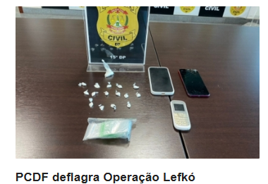

# Avaliação quanto a Desenvolvimento Web

## Imagens
- [ ] **Adicionar `alt`** para imagens, botões-imagem, gráficos e imagens de mapas com pontos de acesso.
- [ ] **Adicionar `alt=""`** para imagens decorativas que não têm significado.
- [ ] **Incluir a descrição no `alt`** para imagens que contêm texto.
- [ ] **Fornecer descrição detalhada** para imagens complexas (gráficos, diagramas, etc.).
- [ ] **Texto alternativo para imagens funcionais** (botões e links com ícones).

# padrão de imagem do site avaliado

## Vídeos
- [X] **Adicionar legendas** para áudio em vídeos existentes.
- [X] **Evitar conteúdo com *flashes* (gatilhos para convulsões)** ou manter abaixo dos limites.
- [ ] **Incluir audiodescrição** para vídeos com conteúdo visual relevante.
- [ ] **Incluir janela de Libras** para vídeos com informação essencial.
- [ ] **Fornecer transcrição** também para vídeos e áudios ao vivo.

## Padrão de vídeo 

## Controles
- [X] **Adicionar `href`** para links.
- [X] **Adicionar underline** nos links.
- [X] **Adicionar estados de foco** em campos de entrada, botões e elementos interativos.
- [ ] **Adicionar `type="button"`** nos botões.
- [ ] **Identifique e comunique** links que abrem em uma nova guia ou janela.
- [ ] **Evitar mudanças de contexto por foco ou entrada**, ou informar ao usuário.
- [ ] **Permitir desfazer ações feitas por clique ou toque**.

# Padrões de campos de entrada, links e botões

## Formulário
- [X] **Adicionar `label`** para os campos de entrada associados ao elemento correspondente.
- [ ] **Adicionar `<fieldset>` e `<legend>`** para seções no formulário.
- [ ] **Adicionar `autocomplete`** para campos de entrada.
- [X] **Exibir `errors`** (erros) de entrada acima do formulário, após envio.
- [ ] **Adicionar `aria-describedby`** para os campos de entrada.
- [ ] **Exibir mensagens de erro e sucesso** não só visualmente.
- [X] **Evitar solicitar reentrada de informações já fornecidas.**
- [X] **Autenticação sem desafios cognitivos** (sem puzzles, cálculos, etc.).

# Padrão de formulário:

## Mídia
- [X] **Impedir `autoplay`** para vídeos e áudios.
- [ ] **Adicionar `type`** para botões e entradas.
- [X] **Adicionar pausa** para todas as mídias.
- [ ] **Adicionar transcrição** para áudios.

## Semântica
- [X] Uso de elementos **nativos HTML**.
- [X] Fluxo contínuo e **lógico**.
- [X] Tem **descrições** que podem ser **facilmente compreendidas**.
- [X] Tem a **semântica correta**.
- [ ] É **objetivo** nos **rótulos**.

# Elementos HTML nativos

## Texto
- [ ] **Evitar** o uso de **textos dentro de imagens**.
- [X] **Redimensiona os textos na página**, aumentando o zoom em até 200%.
- [X] **Alturas** das fontes **não são fixas**.
- [X] **Garantir espaçamento entre letras, palavras e parágrafos**.

# textos dentro de imagem

## Teclado
- [X] **Funcionalidades** da página web estão **disponíveis por teclado**.
- [X] Quando se tem o **mouseover é permitido o uso de teclado**.
- [ ] **Foco visível** – remova elementos focalizáveis ​​invisíveis.
- [X] Adicionar o **`.hover, .focus {}`** para tornar o foco visível.
- [X] Permite/visa o uso de **atalhos de teclado** como o `TAB`.
- [ ] **Primeiro** item interativo da página é um link para o **conteúdo principal**.
- [ ] **Evitar atalhos com teclas únicas** ou permitir desativar/remapear.
- [ ] **Fornecer instruções** para uso de componentes customizados.

## Título
- [X] A **hierarquia** de conteúdo da página é definida por sua **lógica**, não pelo tamanho do texto.
- [X] Use **elementos de título `h1 h2 h3`** para apresentar o conteúdo.
- [ ] **Não pular níveis lógicos**.
- [ ] **Toda página contém um título `h1`** descrevendo a página.

# homepage e elementos de título

## Tabela
- [X] **Use o `table`** para elementos em formato de tabela.
- [ ] Insira cabeçalhos para explicar os dados, **use `th` com `scope` correto**.
- [ ] **Use o `caption`** para fornecer um título para a tabela.
- [ ] **Associação semântica entre cabeçalhos e células**.
- [ ] **Evitar uso de tabelas para layout**.

# Exemplos de tabela

## Modais
- [X] Deve ser **fácil fechar**.
- [X] Permitir o **uso da tecla escape `ESC`**.
- [ ] A interação é uma **tarefa simples**.
- [X] **Evita** modais em **tela cheia**.
- [X] **Não abrir um modal a partir de outro modal**.

# Exemplo de modal

## Dispositivo Móvel e Tocável
- [X] O site pode ser **rotacionado** para qualquer orientação.
- [X] **Impedir** rolagem horizontal.
- [X] **Garantir** que botões e links possam ser ativados facilmente.
- [X] **Garantir** espaço suficiente entre elementos interativos.
- [X] **Área clicável mínima de 24px CSS**, preferencialmente 44px (WCAG 2.2).

# Exemplos de responsividade

## Ferramentas e Extras
- [X] Usar **breadcrumbs** informando a localização atual nas páginas.
- [ ] Colocar página ou **área de dúvidas e dicas de acessibilidade**.
- [ ] Áreas clicáveis com no mínimo **44px de altura e largura**.
- [X] No caso de **captcha**, garantir alternativa acessível.
- [X] Incluir um **campo de busca**.

## Histórico de Versões

| Versão | Descrição | Autor(es) | Data | Revisor(es) | Data de revisão |
|--------|-----------|-----------|------|-------------|-----------------|
| 1.0 | adição de checklist e inicio da avaliação de imagens | [Pedro Luiz](https://github.com/pedroluizfo) | 23/06/2025 |[Gabriel Lopes](https://github.com/BrzGab)  | 24/06/2025 |
| 2.0 | Aplicação de checklist no site, avaliação de desenvolvimento web concluída | [Pedro Luiz](https://github.com/pedroluizfo) | 24/06/2025 |[Gabriel Lopes](https://github.com/BrzGab)  | 24/06/2025 |