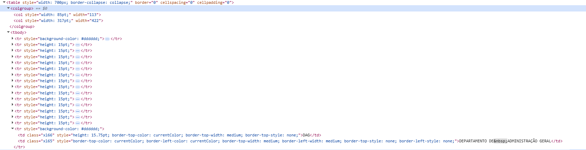

# Avaliação quanto a Desenvolvimento Web

## Imagens
- [ ] **Adicionar `alt`** para imagens, botões-imagem, gráficos e imagens de mapas com pontos de acesso. <a id="TEC1" href="#RP1">[1]</a>
- [ ] **Adicionar `alt=""`** para imagens decorativas que não têm significado. <a id="TEC2" href="#RP2">[2]</a>
- [ ] **Incluir a descrição no `alt`** para imagens que contêm texto. <a id="TEC3" href="#RP3">[3]</a>
- [ ] **Fornecer descrição detalhada** para imagens complexas (gráficos, diagramas, etc.). <a id="TEC4" href="#RP4">[4]</a>
- [ ] **Texto alternativo para imagens funcionais** (botões e links com ícones). <a id="TEC5" href="#RP5">[5]</a>

### Padrão de imagem do site avaliado

*Figura 1: Imagem retirada do site da PCDF demonstrando o padrão de implementação de imagens.*

*Figura 2: Demonstração do texto alternativo (alt) implementado nas imagens do site da PCDF.*

## Vídeos
- [X] **Adicionar legendas** para áudio em vídeos existentes.
- [X] **Evitar conteúdo com *flashes* (gatilhos para convulsões)** ou manter abaixo dos limites.
- [ ] **Incluir audiodescrição** para vídeos com conteúdo visual relevante.
- [ ] **Incluir janela de Libras** para vídeos com informação essencial.
- [ ] **Fornecer transcrição** também para vídeos e áudios ao vivo.

### Padrão de vídeo 

*Figura 3: Vídeo presente no site da PCDF mostrando a implementação de conteúdo audiovisual.*

## Controles
- [X] **Adicionar `href`** para links.
- [X] **Adicionar underline** nos links.
- [X] **Adicionar estados de foco** em campos de entrada, botões e elementos interativos.
- [ ] **Adicionar `type="button"`** nos botões.
- [ ] **Identifique e comunique** links que abrem em uma nova guia ou janela.
- [ ] **Evitar mudanças de contexto por foco ou entrada**, ou informar ao usuário.
- [ ] **Permitir desfazer ações feitas por clique ou toque**.

### Padrões de campos de entrada, links e botões

*Figura 4: Links com underline implementados corretamente no site da PCDF, facilitando a identificação visual.*

*Figura 5: Demonstração do atributo href corretamente implementado nos links do site.*

*Figura 6: Estados de foco visíveis para navegação por teclado, permitindo acessibilidade para usuários com deficiência motora.*

*Figura 7: Implementação do atributo type nos botões do site para melhor semântica HTML.*

## Formulário
- [X] **Adicionar `label`** para os campos de entrada associados ao elemento correspondente.
- [ ] **Adicionar `<fieldset>` e `<legend>`** para seções no formulário.
- [ ] **Adicionar `autocomplete`** para campos de entrada.
- [X] **Exibir `errors`** (erros) de entrada acima do formulário, após envio.
- [ ] **Adicionar `aria-describedby`** para os campos de entrada.
- [ ] **Exibir mensagens de erro e sucesso** não só visualmente.
- [X] **Evitar solicitar reentrada de informações já fornecidas.**
- [X] **Autenticação sem desafios cognitivos** (sem puzzles, cálculos, etc.).

### Padrão de formulário

*Figura 8: Estrutura de formulário implementada no site da PCDF demonstrando organização dos campos de entrada.*

*Figura 9: Labels corretamente associados aos campos de entrada para melhor acessibilidade com leitores de tela.*

*Figura 10: Sistema de tratamento e exibição de erros em formulários do site.*

## Mídia
- [X] **Impedir `autoplay`** para vídeos e áudios.
- [ ] **Adicionar `type`** para botões e entradas.
- [X] **Adicionar pausa** para todas as mídias.
- [ ] **Adicionar transcrição** para áudios.

## Semântica
- [X] Uso de elementos **nativos HTML**.
- [X] Fluxo contínuo e **lógico**.
- [X] Tem **descrições** que podem ser **facilmente compreendidas**.
- [X] Tem a **semântica correta**.
- [ ] É **objetivo** nos **rótulos**.

### Elementos HTML nativos

*Figura 11: Demonstração do uso correto de elementos HTML nativos no site da PCDF, garantindo melhor semântica e acessibilidade.*

## Texto
- [ ] **Evitar** o uso de **textos dentro de imagens**.
- [X] **Redimensiona os textos na página**, aumentando o zoom em até 200%.
- [X] **Alturas** das fontes **não são fixas**.
- [X] **Garantir espaçamento entre letras, palavras e parágrafos**.

### Textos dentro de imagem

*Figura 12: Identificação de textos implementados dentro de imagens no site, que podem gerar problemas de acessibilidade.*

## Teclado
- [X] **Funcionalidades** da página web estão **disponíveis por teclado**.
- [X] Quando se tem o **mouseover é permitido o uso de teclado**.
- [ ] **Foco visível** – remova elementos focalizáveis ​​invisíveis.
- [X] Adicionar o **`.hover, .focus {}`** para tornar o foco visível.
- [X] Permite/visa o uso de **atalhos de teclado** como o `TAB`.
- [ ] **Primeiro** item interativo da página é um link para o **conteúdo principal**.
- [ ] **Evitar atalhos com teclas únicas** ou permitir desativar/remapear.
- [ ] **Fornecer instruções** para uso de componentes customizados.

## Título
- [X] A **hierarquia** de conteúdo da página é definida por sua **lógica**, não pelo tamanho do texto.
- [X] Use **elementos de título `h1 h2 h3`** para apresentar o conteúdo.
- [ ] **Não pular níveis lógicos**.
- [ ] **Toda página contém um título `h1`** descrevendo a página.

### Homepage e elementos de título

*Figura 13: Homepage do site da PCDF mostrando uma visão geral da estrutura e organização do conteúdo.*

*Figura 14: Demonstração da hierarquia de elementos de título (h1, h2, h3) implementada no site.*

## Tabela
- [X] **Use o `table`** para elementos em formato de tabela.
- [ ] Insira cabeçalhos para explicar os dados, **use `th` com `scope` correto**.
- [ ] **Use o `caption`** para fornecer um título para a tabela.
- [ ] **Associação semântica entre cabeçalhos e células**.
- [ ] **Evitar uso de tabelas para layout**.

### Exemplos de tabela

*Figura 15: Implementação de tabelas no site da PCDF demonstrando estrutura e organização de dados tabulares.*

*Figura 16: Inspeção dos elementos HTML da tabela para verificação da semântica e acessibilidade.*

## Modais
- [X] Deve ser **fácil fechar**.
- [X] Permitir o **uso da tecla escape `ESC`**.
- [ ] A interação é uma **tarefa simples**.
- [X] **Evita** modais em **tela cheia**.
- [X] **Não abrir um modal a partir de outro modal**.

### Exemplo de modal

*Figura 17: Exemplo de modal implementado no site demonstrando funcionalidade e padrões de interação.*

## Dispositivo Móvel e Tocável
- [X] O site pode ser **rotacionado** para qualquer orientação.
- [X] **Impedir** rolagem horizontal.
- [X] **Garantir** que botões e links possam ser ativados facilmente.
- [X] **Garantir** espaço suficiente entre elementos interativos.
- [X] **Área clicável mínima de 24px CSS**, preferencialmente 44px (WCAG 2.2).

### Exemplos de responsividade

*Figura 18: Demonstração da capacidade de rotação e adaptação do site em diferentes orientações de dispositivos móveis.*

*Figura 19: Verificação das áreas mínimas de clique para elementos interativos, garantindo usabilidade em dispositivos móveis.*

## Ferramentas e Extras
- [X] Usar **breadcrumbs** informando a localização atual nas páginas.
- [ ] Colocar página ou **área de dúvidas e dicas de acessibilidade**.
- [ ] Áreas clicáveis com no mínimo **44px de altura e largura**.
- [X] No caso de **captcha**, garantir alternativa acessível.
- [X] Incluir um **campo de busca**.

### Breadcrumbs e campo de pesquisa

*Figura 20: Implementação de breadcrumbs no site para facilitar a navegação e orientação do usuário.*

*Figura 21: Campo de busca implementado no site da PCDF para facilitar a localização de conteúdo pelos usuários.*

## Referências Bibliográficas

> <a id="RP1" href="#TEC1">1.</a> WCAG 2.2 Understanding Docs. SC 1.1.1 Non-text Content (Level A).

> <a id="RP2" href="#TEC2">2.</a> WCAG 2.2 Understanding Docs. SC 1.1.1 Non-text Content (Level A). Imagens decorativas.

> <a id="RP3" href="#TEC3">3.</a> WCAG 2.2 Understanding Docs. SC 1.1.1 Non-text Content (Level A). Texto em imagens.

> <a id="RP4" href="#TEC4">4.</a> WCAG 2.2 Understanding Docs. SC 1.1.1 Non-text Content (Level A). Imagens complexas.

> <a id="RP5" href="#TEC5">5.</a> WCAG 2.2 Understanding Docs. SC 1.1.1 Non-text Content (Level A). Imagens funcionais.

## Histórico de Versões

| Versão | Descrição | Autor(es) | Data | Revisor(es) | Data de revisão |
|--------|-----------|-----------|------|-------------|-----------------|
| 1.0 | adição de checklist e inicio da avaliação de imagens | [Pedro Luiz](https://github.com/pedroluizfo) | 23/06/2025 |[Gabriel Lopes](https://github.com/BrzGab)  | 24/06/2025 |
| 2.0 | Aplicação de checklist no site, avaliação de desenvolvimento web concluída | [Pedro Luiz](https://github.com/pedroluizfo) | 24/06/2025 |[Gabriel Lopes](https://github.com/BrzGab)  | 24/06/2025 |